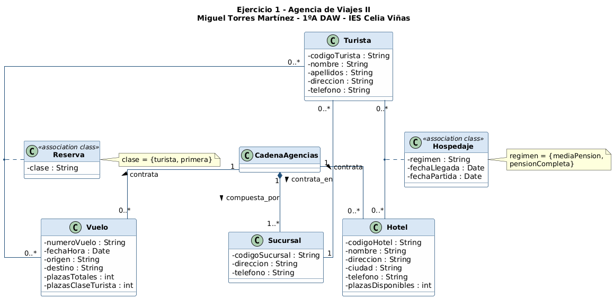
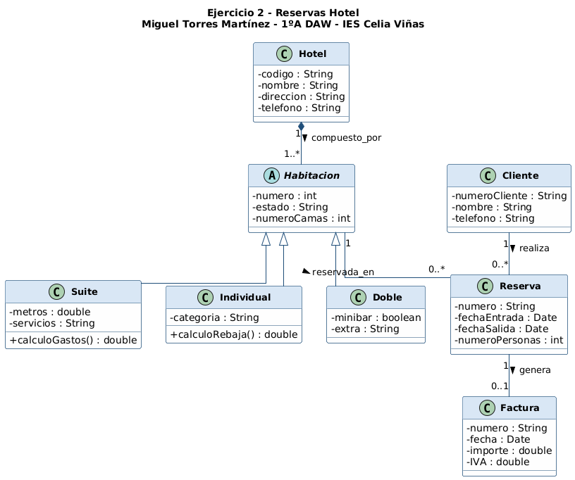
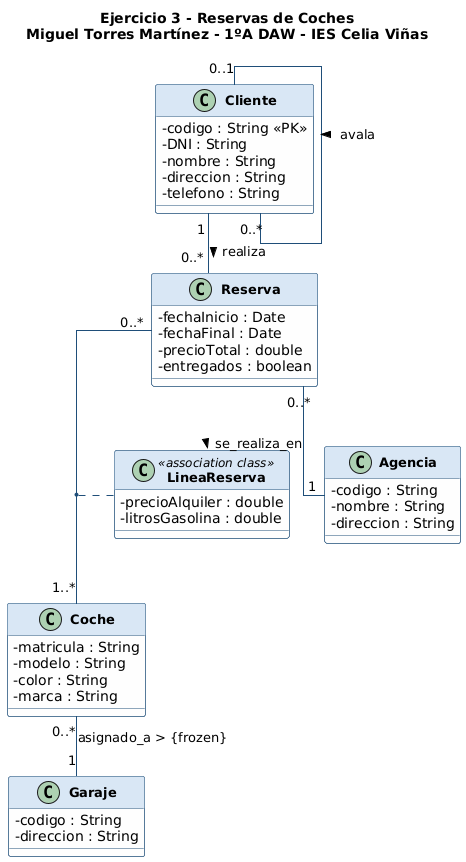
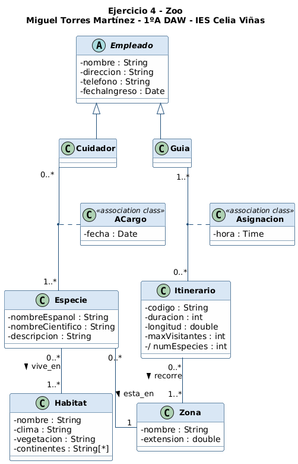

# Tarea 2 UML — Diagramas de Clase (Ampliación)

**Miguel Torres Martínez** — 1ºA DAW — IES Celia Viñas — Curso 2025/2026
**Módulo:** Entornos de Desarrollo — UT5. POO. UML

Resolución de la **Tarea 2** del módulo Entornos de Desarrollo: cuatro
diagramas de clase UML modelados con **StarUML**.

---

## Contenido del repositorio

| Ejercicio | Enunciado | Carpeta |
|-----------|-----------|---------|
| 1 | Agencia de Viajes II | [`Ejercicio1_AgenciaViajes/`](./Ejercicio1_AgenciaViajes) |
| 2 | Reservas Hotel | [`Ejercicio2_ReservasHotel/`](./Ejercicio2_ReservasHotel) |
| 3 | Reservas de Coches | [`Ejercicio3_ReservasCoches/`](./Ejercicio3_ReservasCoches) |
| 4 | Zoo | [`Ejercicio4_Zoo/`](./Ejercicio4_Zoo) |

Cada carpeta contiene:

- `EjercicioN_*.mdj` — proyecto de StarUML con todo el modelo (clases, atributos, operaciones, asociaciones, multiplicidades, generalizaciones y clases de asociación).
- `EjercicioN_*.png` — imagen del diagrama de clases.
- `ejN_*.puml` — fuente PlantUML usada como referencia para la imagen.

---

## Ejercicio 1 — Agencia de Viajes II

**Decisiones de modelado:**

- Clase central `CadenaAgencias` que actúa como contenedor.
- **Composición** `CadenaAgencias 1 — 1..* Sucursal`: las sucursales no existen sin la cadena.
- **Asociación exclusiva** entre `CadenaAgencias` y `Hotel` / `Vuelo` (la multiplicidad `1` en el extremo de la cadena fuerza la exclusividad).
- **Asociación** `Turista — Sucursal (0..* — 1)`: cada turista contrata en una sucursal.
- **Clases de asociación**:
  - `Reserva` (atributo `clase`: turista o primera) entre `Turista` y `Vuelo`, ya que la clase elegida depende de la pareja turista–vuelo concreta.
  - `Hospedaje` (atributos `regimen`, `fechaLlegada`, `fechaPartida`) entre `Turista` y `Hotel`, por el mismo motivo: el régimen y las fechas son del par turista–hotel, no de las clases por separado.

---

## Ejercicio 2 — Reservas Hotel

**Decisiones de modelado:**

- `Habitacion` se modela como **clase abstracta** con tres subclases (`Suite`, `Individual`, `Doble`), aplicando herencia. Los atributos comunes (`numero`, `estado`, `numeroCamas`) se suben a la superclase.
- **Composición** `Hotel 1 — 1..* Habitacion`: las habitaciones forman parte del hotel.
- `Reserva` no incluye el atributo `habitacion` del enunciado: ese dato queda representado por la **asociación** `Habitacion 1 — 0..* Reserva`.
- `Reserva 1 — 0..1 Factura`: una reserva puede generar **0 o 1** factura, y la factura siempre pertenece a una única reserva.
- Las operaciones `calculoGastos()` y `calculoRebaja()` se definen en `Suite` e `Individual` respectivamente, según el enunciado.

---

## Ejercicio 3 — Reservas de Coches

**Decisiones de modelado:**

- `Cliente.codigo` es la clave que diferencia clientes (PK), aunque también se almacena el DNI.
- **Asociación reflexiva** `Cliente 0..1 — 0..* Cliente` con roles `avalador` / `avalado`: un cliente puede estar avalado por otro (o no).
- **Clase de asociación** `LineaReserva` (`precioAlquiler`, `litrosGasolina`) entre `Reserva` y `Coche`: ambos atributos pertenecen al par reserva–coche concreto, no al coche ni a la reserva por sí solos.
- **Restricción `{frozen}`** en la asociación `Coche — Garaje`: el enunciado dice que el garaje asignado a un coche **no puede cambiar**.
- `Reserva — Agencia (0..* — 1)`: cada reserva se realiza en una agencia.
- Atributos en `Reserva`: `fechaInicio`, `fechaFinal`, `precioTotal`, `entregados` (boolean).

---

## Ejercicio 4 — Zoo

**Decisiones de modelado:**

- `Empleado` se modela como **clase abstracta** común de `Cuidador` y `Guia`, ya que ambos comparten los mismos atributos (`nombre`, `direccion`, `telefono`, `fechaIngreso`). Esto evita duplicar la información del enunciado.
- `Especie — Habitat (0..* — 1..*)`: relación m:n directa, sin atributos de asociación.
- `Especie — Zona (0..* — 1)`: cada especie está en una zona; en una zona hay varias.
- `Itinerario — Zona (0..* — 1..*)`: relación m:n.
- **Clase de asociación** `Asignacion` (atributo `hora`) entre `Guia` e `Itinerario`: la hora depende del par guía–itinerario.
- **Clase de asociación** `ACargo` (atributo `fecha`) entre `Cuidador` y `Especie`: la fecha en que un cuidador se hace cargo de una especie pertenece al par.
- `Itinerario.numEspecies` se marca como atributo **derivado** (`/numEspecies`) porque se puede calcular contando las especies de las zonas que recorre el itinerario.

---

## Tarea 1 (parte previa)

La parte 1 de los ejercicios UML está en este otro repositorio:
[**MiguelTorresMartinezUML**](https://github.com/magmiliator77/MiguelTorresMartinezUML).
